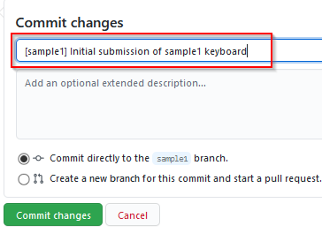
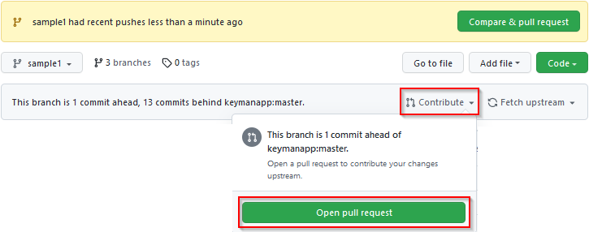

## Verify keyboard builds before submission

Following the file layout documented in [Preliminary Step: Is Your Keyboard Ready?](step-0),
your keyboard folder layout should be similar to:

```
C:\Users\USERNAME\Documents\Keyman Developer\Projects\s\sample1\
```

Before making your submission on GitHub,
you'll need to use Keyman Developer to compile and test the keyboard and the package.
Once you're satisfied that everything works,
delete the "build" folder and its contents.
(This may seem odd, but only the source files are submitted to the Keyman keyboards repository.
All the keyboards on the keyman.com site will be built from the source files.)

You should also delete the .kpj.user file.
(For our example we delete the "s/sample1/sample1.kpj.user" file,
but leave the "s/sample1/sample1.kpj" project file.)

## Create the Pull Request

Now it is time to actually submit your keyboard files.
In the GitHub jargon, you will be putting the files in a specific place (a "branch")
and then requesting the Keyman team to "pull" those changes into keyboards repository.

You will need to have Explorer open and showing your keyboard folder.
Then in your web browser, while logged into GitHub,
open your fork of the **keyboards** repository at:

```
https://github.com/YOUR-GITHUB-NAME/keyboards
```

(replacing `YOUR-GITHUB-NAME` with your actual GitHub account name).

**Note:** The GitHub interface changes from time to time. The following images may vary from what you see on your screen.

Click on the "Branch: master" button and type in the name of the branch you want to create.
We suggest that you use the name of the keyboard as the name of your branch,
but you can use anything that makes sense to you.
After typing the name of the branch, click on "Create branch" or just type the Enter key.


Now you need to navigate to the right location.
**This is the trickiest part of this procedure.**
Take your time and verify each step.

You'll start by double-clicking on the "release" folder
(or the "experimental" folder if you're using that option).
Then you need to double-click on the folder name with the letter
that corresponds to the first letter of your keyboard folder name.
Since the "sample1" keyboard folder name starts with "s", we double-click on the "s" folder.

Now we can click-and-drag the "sample1" folder from the Explorer window and drop that dragged folder
on the browser window that is displaying the existing keyboards that start with "s".
This will copy the "sample1" folder and all its contents to the branch you created in your fork of the keyboards repository.

**Note:** sometimes (especially if you're using the "experimental" folder)
there is no existing letter folder corresponding to the first letter of your keyboard name.
In that case, your keyboard folder needs to be under a letter folder
and you need to drag that folder to the browser window that is displaying the list of letter folders.
In the example, you would click-and-drag the "s" folder (which contains the "sample1" folder)
to the browser window displaying the list of letter folders.

GitHub now displays a list of files that were copied.
Double check the files in this list.

Below the list there is a place to "commit" your changes.
Replace the default commit message with the name of your keyboard in square brackets followed by a short comment.
Then click on the green "Commit changes" button.



Now GitHub shows you the branch (to which you've just added files) and offers you several options.
The one you want is the "Pull request" link.



The "pull request" is ready to be submitted.
You can add a comment if you like.
It's helpful if you select the "Allow edits by maintainers" checkbox.
This allows reviewers to make minor corrections without needing to ask you to do them.
When you're ready, click on the "Create pull request" button.
GitHub will assign a number to your pull request.


Congratulations! Some of our teammates will follow-up with you and communicate
any revisions that need to be made for your keyboard to be added to the repository.
These messages will show up under the pull request number that GitHub assigned.

Once your pull request is ready, the changes in your branch will be merged.
After your branch has been merged into the **keyboards** repository,
you won't need the branch and can safely delete it.
If you won't be creating another keyboard (or if it will be a while before you do),
you can delete your fork of the keyboards repository as well.
