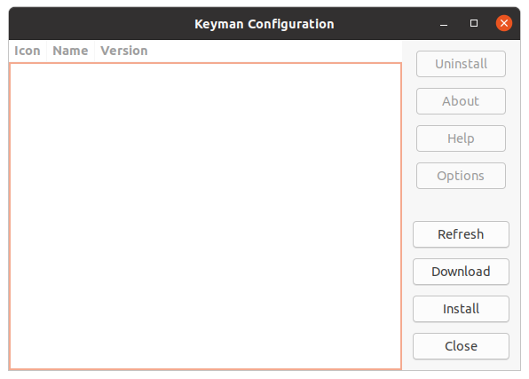
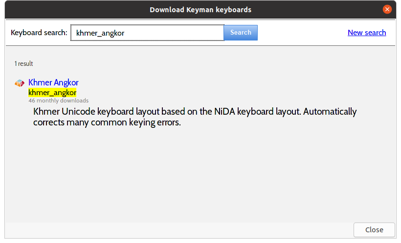
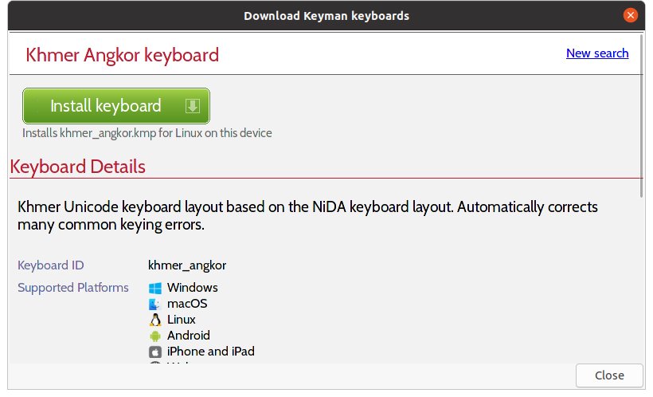
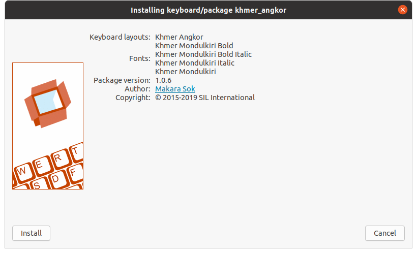
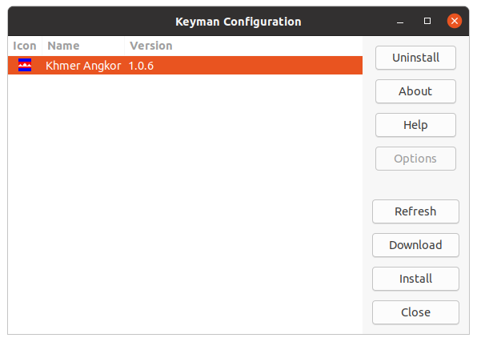
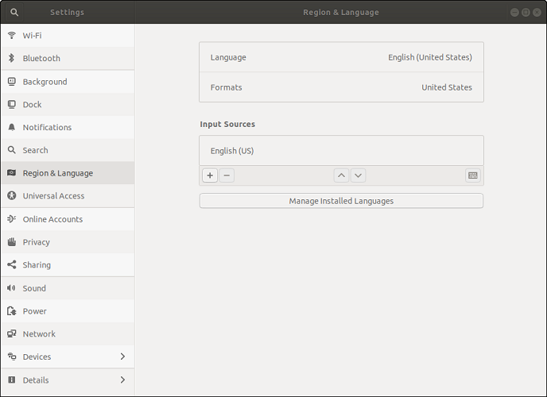
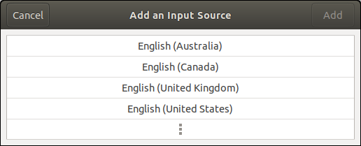
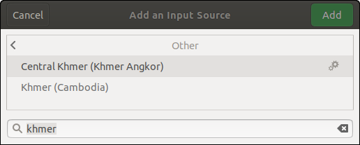

Keyboards are installed with Keyman Configuration. From the launcher, enter `Keyman Configuration`.

## Download from Keyman cloud repository
From Keyman Configuration, click "Download". At the search page, enter the keyboard you want to download.

Clicking the keyboard brings the keyboard page which has a link for installation.

## Install Local .kmp keyboard package
Keyman for Linux can also install keyboards from local .kmp keyboard packages. From Keyman Configuration,
click "Install". Then browse to the local .kmp keyboard package and install.

The keyboard should appear in Keyman Configuration.

### Install the Input Source in Region & Language Settings
This section is only relevant for Ubuntu. At this point the keyboard should be ready to use on Wasta.

**Note:** Keyman Configuration only installs the keyboard into IBus. In order to use the keyboard in Ubuntu,
access your system Settings and click "Region & Language".

Click "+" to add the input source. Click the 3 dots to search for other input sources.

Search for the keyboard you added.

Your input source is now accessible in IBus. Use the shortcut Windows-spacebar to switch input source.

