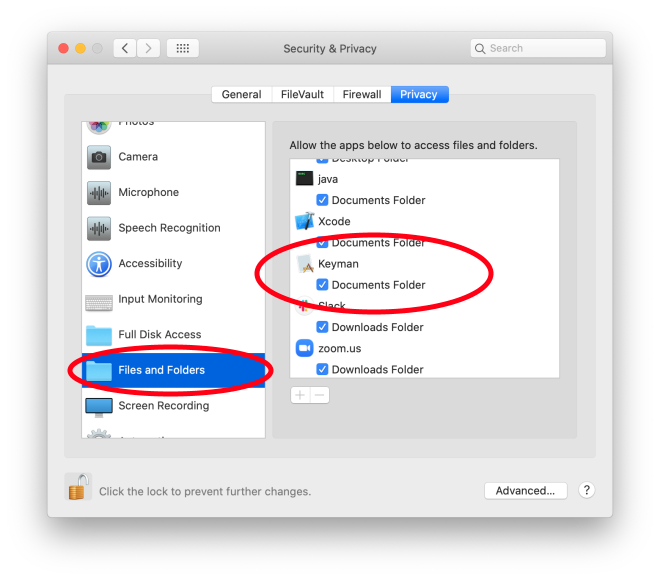

Keyman requires access to your keyboard in order to translate input. Keyman and macOS  will prompt you to grant permissions to the following Privacy settings so that Keyman will work correctly:

* **Privacy** / **Accessibility**
* **Privacy** / **Files and Folders**

After first selecting Keyman from the system menu, you will see an alert requesting access to your Documents folder:

   

Click OK to allow access to the Documents folder.

Immediately after this alert is dismissed, another alert will appear:

   

Unlike the previous alert, you cannot grant Accessibility permission to Keyman by simply clicking a button. This change must be made in the System Preferences (called 'System Settings' beginning with macOS 13 Ventura). After you click OK, you may briefly see another alert from macOS:

   

and then the Security & Privacy settings window will open over the top of it:

   

With **Accessibility** selected, unlock the settings by clicking on the lock icon. Then click on the Keyman checkbox to grant Keyman permission.

After enabling this setting, you must restart the system for it to take effect.

----
**Note: You must restart your system after making these changes!**
----

Symptoms that you may experience if Privacy settings are not configured correctly include:

* Some key combinations may not work
* Some letters may be duplicated or not deleted as expected
* The on-screen keyboard may not work

## Upgrading macOS

You should only have to undertake this procedure once. However, if you upgrade your
version of macOS, and Keyman stops working, you can return to System Preferences to re-enable these settings.

The **Documents Folder**  setting is found here:

   

And the **Accessibility** setting is found here:

   
